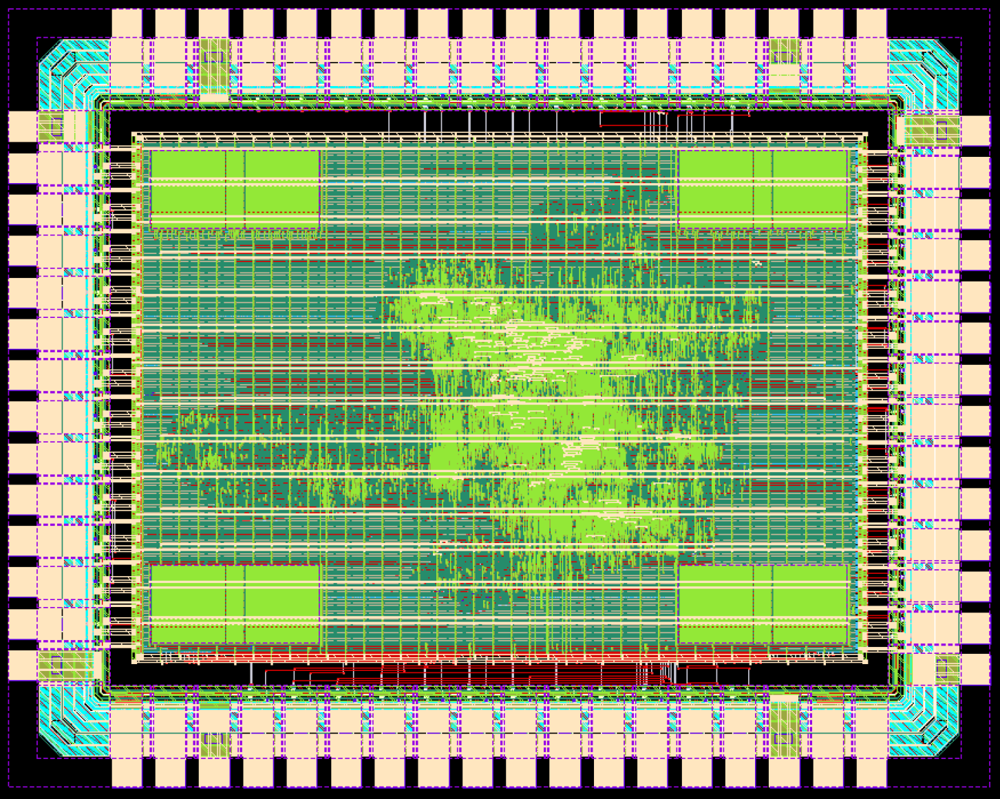
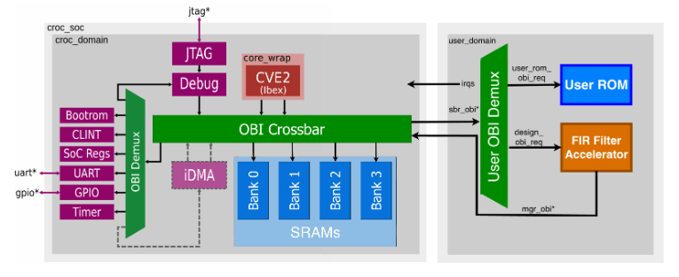
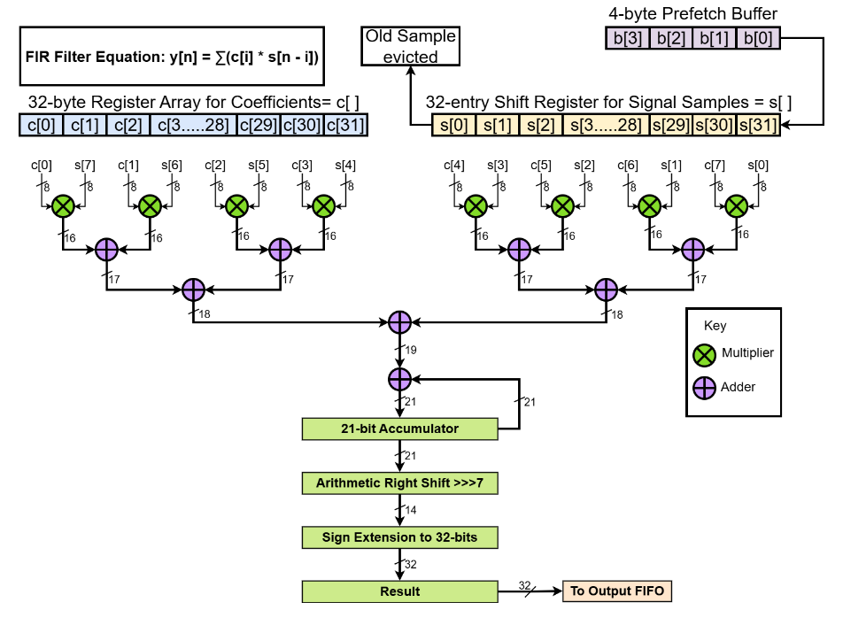

# CrocFIRe — A 32-Tap FIR Filter Accelerator for Croc SoC

This project focuses on the design, integration and physical implementation of a hardware-accelerated 32-tap FIR Filter Accelerator on the Croc SoC, developed as a part of the VLSI II course at ETH Zurich. The baseline design was extended by integrating a parameterizable FIR filter accelerator into the user domain, supporting 1, 2, 4, 8 and 16 parallel MAC units. The accelerator implements a blocked FIR architecture operating on signed 8-bit signal samples with Q0.7 fixed-point coefficients, communicating with the Croc using the Open Bus Interface (OBI). The repository covers the RTL design, verification, testing, and the backend physical implementation, culminating in a DRC-free tape out ready chip.

<p align="center">
  
</p>

For a detailed discussion of the architecture, design trade-offs and PPA analysis across the 1/2/4/8/16 MAC configurations, see the [CrocFIRe Design Report](CrocFIRe_Design_Report.pdf).


## FIR Accelerator Integration with Croc System-on-Chip


Croc is a simple SoC for education using PULP IPs developed as part of the PULP project, a joint effort between ETH Zurich and the University of Bologna. Croc includes all scripts necessary to produce a nearly finished chip in [IHPs open-source 130nm technology](https://github.com/IHP-GmbH/IHP-Open-PDK/tree/main).

For more information on the Croc SoC, the exact code and scripts can be found at: https://github.com/pulp-platform/croc

<p align="center">
  
</p>

The figure above shows the updated Croc SoC architecture with the FIR accelerator integrated into the user domain. The accelerator interfaces with the rest of the SoC through two OBI ports. The subordinate (SBR) OBI port allows the CVE2 core to configure the accelerator by writing to its memory-mapped registers, including the number of input samples, filter coefficients, and the start signal, and to poll the done status register upon completion. The manager (MGR) OBI port allows the accelerator to autonomously fetch signal samples from SRAM Bank 2 and write computed results to SRAM Bank 3, without CPU involvement after initial configuration. Within the user domain, an address decoder distributes incoming transactions to the FIR accelerator, the User ROM, or a default error subordinate for unmapped accesses.

## FIR Filter Accelerator Architecture

<p align="center">
  
</p>

The SoC is composed of two main parts:

- The `croc_domain` containing a CVE2 core (a more minimal fork of Ibex), SRAM, an OBI crossbar and a few simple peripherals
- The `user_domain` where students are invited to add their own designs or other open-source designs (peripherals, accelerators...)

The main interconnect is OBI, you can find [the spec online](https://github.com/openhwgroup/obi/blob/072d9173c1f2d79471d6f2a10eae59ee387d4c6f/OBI-v1.6.0.pdf).

The various IPs of the SoC (UART, OBI, debug-module, timer...) come from other PULP repositories and are managed by [Bender](https://github.com/pulp-platform/bender).
To make it easier to browse and understand, only used or important building blocks are included in `rtl/<IP>`. You may want to explore the repositories of the respective IPs to find their documentation or additional functionality, the urls are in `Bender.yml`.

## Bootmodes

Currently the only way to boot is via JTAG.

## Memory Map

The table below presents the complete SoC memory map including both the original Croc peripherals and the
additions made in this project. Two additional SRAM banks were added to support the accelerator: Bank 2
at 0x10001000 to 0x10001800 for input signal samples and Bank 3 at 0x10001800 to 0x10002000 for computed output results. The FIR accelerator’s Memory-Mapped (MM) registers are accessible at 0x20000400,
and the User ROM at 0x20000000.

| Start Address   | Stop Address    | Description                                    |
| --------------- | --------------- | ---------------------------------------------- |
| `32'h0000_0000` | `32'h0004_0000` | Debug module (JTAG)                            |
| `32'h0200_0000` | `32'h0200_4000` | BootROM                                        |
| `32'h0204_0000` | `32'h0208_0000` | CLINT peripheral                               |
| `32'h0300_0000` | `32'h0300_1000` | SoC control/info registers                     |
| `32'h0300_2000` | `32'h0300_3000` | UART peripheral                                |
| `32'h0300_5000` | `32'h0300_6000` | GPIO peripheral                                |
| `32'h0300_A000` | `32'h0300_B000` | Timer peripheral                               |
| `32'h0300_B000` | `32'h0300_C000` | (optional) DMA configuration                   |
| `32'h1000_0000` | `32'h1000_0800` | SRAM Bank 0                                    |
| `32'h1000_0800` | `32'h1000_1000` | SRAM Bank 1                                    |
| `32'h1000_1000` | `32'h1000_1800` | SRAM Bank 2 (For storing signal samples)       |
| `32'h1000_1800` | `32'h1000_2000` | SRAM Bank 3 (For storing FIR filtered results) |
| `32'h2000_0000` | `32'h8000_0000` | Passthrough to User Domain                     |
| `32'h2000_0000` | `32'h2000_0400` | Reserved for User ROM text                     |
| `32'h2000_0400` | `32'h2000_0490` | FIR Accelerator MM Registers                   |

## Memory Mapped (MMIO) Registers

| Offset      | Address                   | Access | Description                                     |
| ----------- | ------------------------- | ------ | ----------------------------------------------- |
| `0x00`      | `0x2000_0400`             | Write  | Start computation (write 1 to trigger)          |
| `0x04`      | `0x2000_0404`             | Read   | Computation done flag (reads 1 when complete)   |
| `0x08`      | `0x2000_0408`             | Write  | Total sample count (16-bit, valid range 36–540) |
| `0x0C`      | `0x2000_040C`             | Read   | Invalid length flag (reads 1 on error)          |
| `0x10–0x8C` | `0x2000_0410–0x2000_048C` | Write  | Filter coefficients c[0] – c[31]                |


## Flow


## Requirements

Please refer to the excellent docker container maintained by Harald Pretl. 
If you get stuck with installing the tools, we urge you to check the [Tool Repository](https://github.com/iic-jku/IIC-OSIC-TOOLS).  
The current supported version is 2025.12, no other version is officially supported.

## Benchmarking Kernels and RTL Simulation with Verilator

The RTL files for the FIR Filter Accelerator are in `rtl/user_domain`.
The modules are instantiated in `rtl/user_domain.sv`.

The `test_fir_acc_sw.c` is the software implementation kernel for computing the FIR filtered output samples on the Croc SoC baseline.

To compile the software binaries and generate the ELF
1. Go to `sw/`
2. Run `make`

```bash
cd sw
make
```

For running the software baseline kernel implementation:
1. Go to `verilator/`
2. Run `./run_verilator.sh --build --run ../sw/bin/test_fir_acc_sw.hex`
3. To view the waveform: `gtkwave croc.fst &`

```bash
cd verilator
./run_verilator.sh --build --run ../sw/bin/test_fir_acc_sw.hex
```

The `test_fir_acc_hw.c` is the kernel implementation for computing the FIR filtered output samples using the Hardware accelerator.

For running the hardware-accelerated kernel implementation:
1. Go to `verilator/`
2. Run `./run_verilator.sh --build --run ../sw/bin/test_fir_acc_hw.hex`
3. To view the waveform: `gtkwave croc.fst &`

```bash
cd verilator
./run_verilator.sh --build --run ../sw/bin/test_fir_acc_hw.hex
```
## ASIC Design Flow

### Synthesis

Bender generates the source file list using the dependencies (Libraries) and sources (RTL files) listed in Bender.yml file. The RTL files in the source file list from Bender were synthesized with Yosys, to generate the gate-level netlist. The logic is mapped on to IHP SG13G2 130 nm Standard-cell library at the typical corner.

```bash
cd yosys/
./run_synthesis.sh --synth
```

### Physical Implementation

The gate-level netlist is taken through the physical implementation flow in OpenROAD, run from `openroad/` as five stages - Floor Planning & Power Grid Placement, Standard Cells Placement, Clock Tree Synthesis, Global and Detailed Routing, and finally Finishing (Filler cells and final output generation).

Each stage writes out the design database in ODB format(OpenROAD Database) that the next one picks up, producing the final DEF file (croc.def) for DRC and LVS Checks. 

```bash
cd openroad/
./run_backend.sh --floorplan
./run_backend.sh --placement
./run_backend.sh --cts
./run_backend.sh --routing
./run_backend.sh --finishing
```

### DRC & LVS Checks

DRC checks were performed on KLayout tool.

1. Navigate to `klayout/`
2. Run `./def2gds-croc` to generate GDS from the DEF file generated by OpenROAD.
3. Run `./start_klayout out/croc.gds` to open the GDS file on KLayout
4. Run `./run_drc-croc` to perform the DRC check on the `croc.gds` file.

```bash
cd klayout/
./def2gds-croc
./start_klayout out/croc.gds
./run_drc-croc
```

LVS checks were performed on the Calibre tool from Siemens, since there were no Open Source options available for LVS.

Note: Calibre is a licensed tool. The rest of the flow uses open source tools.

1. Navigate to `calibre/`
2. Run `./start_calibre` to initiate the software
3. Open the DRC free GDS file: File → Open Layout Files → `klayout/out/croc.gds`
4. Open a new terminal window
5. Go to `calibre/lvs`
6. Run `./verilog2spice ../../openroad/out/croc_lvs.v croc_chip.spice`
7. In the Calibre DRV main window, select `Verification → nmLVS`
8. Select the correct GDS file under the Layout section. Select the correct SPICE file under the Inputs section.
9. Click on the `RUN LVS` to run LVS.

The design was thoroughly verified to be DRC and LVS free. Should any DRC or LVS issues arise, they can be resolved by:
 
1. Manually drawing the necessary shapes / extensions / connections 
2. Modifying the placement, routing, CTS backend scripts using available OpenROAD commands (Refer to OpenROAD Documentation: https://openroad.readthedocs.io/en/latest/)

## License

Unless specified otherwise in the respective file headers, all code checked into this repository is made available under a permissive license. All hardware sources and tool scripts are licensed under the Solderpad Hardware License 0.51 (see `LICENSE.md`). All software sources are licensed under Apache 2.0.
